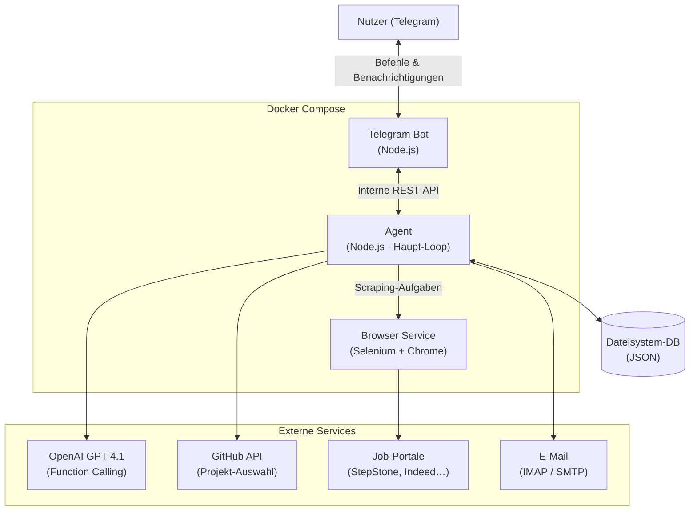

# OpenClaw Job Application Agent

[](https://nodejs.org)
[](https://docker.com)
[](https://openai.com)
[](https://telegram.org)
[](LICENSE)

Autonomer Agent, der Job-Portale durchsucht, individuelle Bewerbungsunterlagen mit LLMs generiert und den gesamten Prozess über Telegram steuerbar macht.

## Architektur



Der Agent läuft als **autonomer Loop**: Daten sammeln → LLM-Analyse → Bewerbung generieren → Telegram-Benachrichtigung → auf Freigabe warten → versenden. Jeder Schritt ist eine Funktion, die der LLM über Function Calling dispatcht.

## Tech Stack

| Kategorie | Technologie | Warum |
|:----------|:------------|:------|
| Agent-Loop | Node.js + OpenAI Function Calling | Strukturiertes Tool-Dispatching statt hardcoded Logic — [ADR-001](docs/adr/001-function-calling.md) |
| Persistenz | JSON-Dateisystem-DB | Dokument-orientiertes Datenmodell ohne Query-Komplexität — [ADR-002](docs/adr/002-dateisystem-db.md) |
| Infrastruktur | Docker Compose (3 Services) | Browser isoliert vom Agent für Stabilität — [ADR-003](docs/adr/003-docker-multiservice.md) |
| Steuerung | Telegram Bot API | Asynchrone Push-Benachrichtigungen + Kommandos aus der Hosentasche |
| Web-Scraping | Selenium + Chrome | JavaScript-rendering-fähig für moderne Job-Portale |
| E-Mail | Nodemailer (SMTP) + IMAP | Bewerbungsversand + E-Mail-Alert-Monitoring |
| Testing | Jest (90+ Unit Tests) | Kritische Skills (Matching, Generierung) abgedeckt |

## Projektstruktur

```
openclaw-job-application-agent/
├── src/
│   ├── agent/          # Haupt-Loop: planen, ausführen, koordinieren
│   ├── skills/         # Atomare Fähigkeiten (jobSearch, generateDoc, sendEmail…)
│   ├── services/       # GitHub-Integration, Prompt-Service
│   ├── telegram/       # Bot-Commands und Benachrichtigungen
│   ├── api/            # Interne REST-API (Agent ↔ Telegram-Bot)
│   └── utils/          # Logger, ErrorHandler
├── config/             # Konfigurationsdateien
├── data/               # Dateisystem-DB (Queue, Logs, Bewerbungshistorie)
├── docs/
│   ├── adr/            # Architecture Decision Records
│   ├── ARCHITECTURE.md
│   ├── API_DOCUMENTATION.md
│   └── PRODUCTION_DEPLOYMENT.md
├── tests/              # Jest Unit Tests
├── docker-compose.yml  # 3-Service-Setup
└── .env.example
```

## Architekturentscheidungen (ADRs)

- [ADR-001 – OpenAI Function Calling für den Agent-Loop](docs/adr/001-function-calling.md)
- [ADR-002 – Dateisystem-DB statt SQL](docs/adr/002-dateisystem-db.md)
- [ADR-003 – Docker 3-Service-Architektur](docs/adr/003-docker-multiservice.md)

## Installation & Verwendung

Vollständige Anleitung: **[Production Deployment Guide](docs/PRODUCTION_DEPLOYMENT.md)**

```bash
# 1. Klonen und konfigurieren
git clone https://github.com/tib019/openclaw-job-application-agent.git
cd openclaw-job-application-agent
cp .env.example .env && nano .env

# 2. Starten
docker-compose up -d

# 3. Verwenden (Telegram)
/status          → Systemstatus
/search Python   → Manueller Suchlauf
/approve all     → Alle Bewerbungen freigeben
/send            → Freigegebene Bewerbungen versenden
```

## Sicherheit

Docker-Isolation aller Services · Environment Variables für alle Credentials · Read-Only Volumes für Master-Dokumente · Masked Logging (keine Credentials in Logs) · Automatisierte Backups

## Dokumentation

- [Architektur-Dokumentation](docs/ARCHITECTURE.md)
- [API-Dokumentation](docs/API_DOCUMENTATION.md)
- [Sicherheitskonzept](docs/SECURITY_CONCEPT.md)
- [Benutzerhandbuch](docs/USER_MANUAL.md)
- [Deployment-Guide](docs/PRODUCTION_DEPLOYMENT.md)

---

**Tobias Buß** · Hamburg · [github.com/tib019](https://github.com/tib019)
