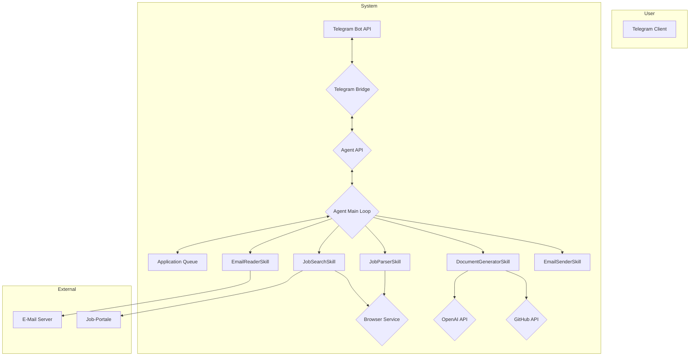

# Technische Projektdokumentation

**Projekt:** OpenClaw Job Application Agent  
**Version:** 2.0.0  
**Datum:** 07. Februar 2026  
**Autor:** Tobias Heiko Buß

---

## 1. Einleitung

### 1.1 Projektziel

Ziel dieses Projekts ist die Entwicklung eines autonomen, intelligenten Agenten zur Automatisierung des gesamten Bewerbungsprozesses. Der Agent soll selbstständig passende Stellenanzeigen finden, individuelle Bewerbungsunterlagen erstellen und den Versand nach Freigabe durch den Benutzer durchführen.

### 1.2 Problemstellung

Der manuelle Bewerbungsprozess ist zeitaufwändig und repetitiv. Die Suche nach passenden Stellen auf verschiedenen Portalen, die Anpassung von Anschreiben und Lebenslauf sowie die Verwaltung des Bewerbungsstatus erfordern einen erheblichen manuellen Aufwand.

### 1.3 Lösung

Die Lösung ist ein Multi-Container-System auf Basis von Docker, das einen autonomen Agenten orchestriert. Dieser Agent nutzt eine Kombination aus Web-Scraping, E-Mail-Automatisierung und KI (LLMs) zur intelligenten Automatisierung des Bewerbungsprozesses. Die Steuerung erfolgt über einen Telegram Bot.

---

## 2. Systemarchitektur

### 2.1 Architektur-Übersicht

Das System basiert auf einer Microservices-Architektur, die mit Docker-Compose orchestriert wird. Es besteht aus drei Haupt-Services:

1.  **Agent-Service:** Der Kern des Systems, der den Main Loop, die Skills und die REST-API enthält.
2.  **Telegram-Bridge:** Die Schnittstelle zum Benutzer, die Befehle entgegennimmt und an den Agent-Service weiterleitet.
3.  **Browser-Service:** Ein Headless-Browser (Selenium Chrome) für Web-Scraping-Aufgaben.

Alle Services kommunizieren über ein internes Docker-Netzwerk.

### 2.2 Architektur-Diagramm



### 2.3 Technologie-Stack

| Kategorie | Technologie |
|:----------|:------------|
| **Backend** | Node.js, Python |
| **KI** | OpenAI GPT-4.1-mini, Function Calling |
| **Automatisierung** | Selenium, Nodemailer, IMAP |
| **Datenbank** | JSON-basierte File-System-DB |
| **Deployment** | Docker, Docker-Compose |
| **API** | REST (Express.js) |
| **Kommunikation** | Telegram Bot API |
| **Testing** | Jest |

---

## 3. Komponenten-Beschreibung

### 3.1 Agent-Service (Node.js)

**Verantwortlichkeiten:**
- Orchestrierung aller Skills im Main Loop
- Verwaltung der Application Queue
- Bereitstellung der REST-API
- Kommunikation mit externen APIs (OpenAI, GitHub)

**Kern-Komponenten:**
- `MainLoop.js`: Der Orchestrator, der alle 4 Stunden läuft.
- `AgentAPI.js`: Die Express.js-basierte REST-API.
- `skills/`: Verzeichnis mit allen Skills.
- `services/`: Verzeichnis mit externen Service-Integrationen.
- `utils/`: Hilfsfunktionen (Logger, ErrorHandler, etc.).

### 3.2 Telegram-Bridge (Python)

**Verantwortlichkeiten:**
- Kommunikation mit der Telegram Bot API
- Parsen von Benutzer-Befehlen
- Weiterleitung von Anfragen an die Agent-API
- Formatierung und Anzeige von Antworten

**Kern-Komponenten:**
- `TelegramBot.py`: Die Hauptklasse des Bots.
- `python-telegram-bot`: Die verwendete Bibliothek.

### 3.3 Browser-Service (Selenium)

**Verantwortlichkeiten:**
- Bereitstellung eines Headless-Browsers
- Ausführung von Web-Scraping-Aufgaben
- Fernsteuerung durch den Agent-Service

**Kern-Komponenten:**
- `selenium/standalone-chrome`: Das verwendete Docker-Image.

---

## 4. Datenmodell

### 4.1 Application Queue

Die Application Queue wird als JSON-Datei (`data/application_queue.json`) gespeichert. Jede Bewerbung ist ein Objekt mit folgendem Schema:

```json
{
  "id": "uuid-v4",
  "status": "pending_review | approved | sent | rejected",
  "createdAt": "ISO-8601",
  "updatedAt": "ISO-8601",
  "jobDetails": {
    "title": "String",
    "company": "String",
    "location": "String",
    "url": "String",
    "description": "String",
    "requiredSkills": ["String"],
    "salary": "String"
  },
  "matchScore": "Number (0-100)",
  "applicationMethod": {
    "type": "email | linkedin | online_form | unknown",
    "email": "String | null"
  },
  "generatedDocuments": {
    "coverLetterPath": "String",
    "resumePath": "String"
  },
  "githubProjects": [
    {
      "name": "String",
      "url": "String",
      "matchScore": "Number (0-100)"
    }
  ],
  "mlFeatures": {
    "..."
  },
  "decision": "approved | rejected | null"
}
```

### 4.2 User Profile

Das Benutzerprofil (`config/user_profile.json`) enthält alle persönlichen und beruflichen Daten, die für die Bewerbungserstellung benötigt werden.

---

## 5. Sicherheit

### 5.1 Authentifizierung & Autorisierung

- **Externe APIs:** API-Keys und Tokens werden als Environment Variables gespeichert.
- **Interne API:** Die Agent-API ist nur innerhalb des Docker-Netzwerks erreichbar.
- **Telegram Bot:** Die Kommunikation wird durch den Bot-Token gesichert.

### 5.2 Datensicherheit

- **Credentials:** Alle Zugangsdaten werden in einer `.env`-Datei gespeichert und nicht versioniert.
- **Sensitive Daten:** Persönliche Daten im `user_profile.json` werden mit `chmod 600` geschützt.
- **Backups:** Tägliche, verschlüsselte Backups der `data/` und `config/` Verzeichnisse.

### 5.3 Netzwerk-Sicherheit

- **Docker-Netzwerk:** Alle Services kommunizieren über ein internes, isoliertes Netzwerk.
- **Firewall:** UFW ist so konfiguriert, dass nur die notwendigen Ports (SSH, Healthcheck) geöffnet sind.

---

## 6. Testing

### 6.1 Unit Tests

- **Framework:** Jest
- **Coverage:** ~70%
- **Test-Suites:** 5 (EmailReader, JobParser, GitHubService, PromptService, ApplicationQueue)
- **Gesamte Tests:** 91

### 6.2 Integration Tests (geplant)

- Testen der Interaktion zwischen den Services (Agent-API ↔ Telegram-Bridge).

### 6.3 End-to-End Tests (geplant)

- Simulation eines vollständigen Bewerbungsprozesses.

---

## 7. Deployment

### 7.1 Docker-Deployment (empfohlen)

- **Orchestrierung:** Docker-Compose
- **Start:** `docker-compose up -d`
- **Monitoring:** `docker-compose logs -f`

### 7.2 Native Deployment

- **Dependencies:** `npm install`, `pip3 install -r requirements.txt`
- **Start:** Manuelles Starten der 3 Services in separaten Terminals.
- **Autostart:** Systemd-Services für jeden Prozess.

### 7.3 Monitoring

- **Healthcheck:** `GET /health` Endpoint liefert detaillierten Systemstatus.
- **Logging:** Strukturierte JSON-Logs in `/app/logs/agent.log`.
- **Error-Tracking:** `GET /api/errors/recent` Endpoint liefert die letzten Fehler.

---

## 8. Wartung & Support

### 8.1 Automatische Wartung

- **Log Rotation:** Automatisch bei 10 MB.
- **Cache Refresh:** Automatisch nach 24h (GitHub) bzw. 1h (Jobs).
- **Backups:** Täglich um 2 Uhr nachts.

### 8.2 Support-Kanäle

- **Dokumentation:** `/docs` Verzeichnis
- **GitHub Issues:** Für Bug-Reports und Feature-Requests
- **Logs:** `/app/logs/agent.log` für detaillierte Fehleranalyse

---

## 9. Zukünftige Erweiterungen

- **LinkedIn Easy Apply Integration**
- **Modulare ATS-Skills** (Workday, Greenhouse, Lever)
- **ML-basiertes Job-Scoring**
- **Wöchentliches Reporting**
- **Automatisches Follow-up**
- **CI/CD-Pipeline**
- **Grafana Dashboard**

---

**Ende der Technischen Projektdokumentation**
